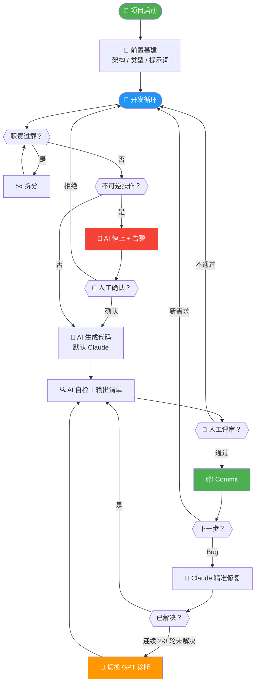

好，综合所有讨论，以下是最终完整版。

---

# 文档二：Vibe Coding 复杂度管理与人机协作 SOP v1.0

## 核心共识

**人类界定边界，AI 高效填充。**

在 AI 驱动开发（Vibe Coding）中，代码生成速度极快。若无强硬的工程边界，项目极易失控。本 SOP 旨在通过明确的过程规范约束 AI，确保代码库长期可维护。

**人工最终裁决原则：** AI 的一切自检结论仅作为参考清单，不作为质量担保。是否合入、是否发布，以人类开发者对当前变更内容的评审结果为准。

---

## 📊 全流程总览



| 颜色 | 含义 |
|---|---|
| 🟢 绿色 | 里程碑（启动、提交） |
| 🔵 蓝色 | 开发循环入口 |
| 🔴 红色 | 危险操作阻断 |
| 🟠 橙色 | 模型升级切换（Claude → GPT） |
| ◇ 菱形 | 人工决策点 |

---

## 📍 阶段一：前置基建（开工前约束）

在 AI 编写业务逻辑前，必须完成以下硬性配置，确立项目的底层秩序：

1. **人工搭建核心架构**
   * **规范：** 开发者需手动执行脚手架（如 Vite, Next.js），并亲自创建核心目录（如 `src/api`, `src/components`, `src/hooks`）。
   * **红线：** 严禁让 AI 从零开始自由发挥生成项目骨架。

2. **强制类型与代码规范**
   * **规范：** 必须在项目初期配置好静态检查工具（如 `ESLint`, `Prettier`）。
   * **红线：** 前端项目强制使用 **TypeScript**，并在 ESLint 中开启 `@typescript-eslint/no-explicit-any: error`；后端项目强制开启类型提示（Type Hinting）。失去类型约束，AI 极易产生逻辑幻觉。
   * **`any` 豁免机制：** 默认全局禁用 `any`。仅在以下条件**同时满足**时，允许逐行豁免：
     1. 第三方库类型定义确实缺失或不完整，且无 `@types/*` 包可用；
     2. 在该行上方添加 `// eslint-disable-next-line @typescript-eslint/no-explicit-any -- [原因]`，明确写出豁免理由；
     3. 同一行紧跟注释 `// FIXME(type): 待补全类型`，标记为待修复项。

     **示例：**
     ```typescript
     // eslint-disable-next-line @typescript-eslint/no-explicit-any -- legacy-sdk 无类型定义
     const result: any = legacySdk.query(params); // FIXME(type): 待补全类型
     ```
     > **注意：** 使用 `FIXME` 而非 `TODO`。多数 IDE 和 Lint 工具对 `FIXME` 有更高优先级的告警显示。可在 CI 中通过 `grep -r "FIXME(type)"` 定期统计豁免数量，超过阈值时集中清理。

3. **注入全局系统指令**
   * **规范：** 将核心开发准则（见附录）写入 AI 工具的全局提示词（如 `.cursorrules`），在 AI 写第一行代码前完成约束。

---

## 📍 阶段二：过程控制（开发中监控）

通过设置开发卡点，控制代码体积，阻断系统性风险：

1. **限制单文件职责（防臃肿）**
   * **规范：** 不硬性规定具体的代码行数（如 300 行），但需严格控制文件的职责范围。
   * **红线：** 当一个文件同时包含 UI 渲染、网络请求和复杂计算时，必须强制叫停。引导 AI 按照"单一职责"原则，将逻辑拆分为独立的组件或 Service。

2. **保持项目目录纯净**
   * **规范：** 业务逻辑应通过代码本身或简要注释体现。
   * **红线：** 严禁 AI 在项目中私自创建 `.md` 说明文档、`todo` 记录等非代码文件，保持目录绝对清爽。

3. **危险操作人工阻断**
   * **规范：** 涉及物理删除、清空数据表、重置环境等不可逆操作时，AI 必须停止执行并告警。
   * **红线：** 严禁 AI 静默执行破坏性指令，必须等待人类开发者的显式二次确认。

4. **上下文注入规范**
   * **规范：** 每次新对话开始时，主动向 AI 提供当前任务涉及的文件清单和接口契约，不依赖 AI 自己"记住"项目全貌。
   * **红线：** 严禁在单次对话中让 AI 横跨 3 个以上不相关模块做修改——超出其可靠认知范围。
   * **模板：**
     ```
     [当前任务] 修改用户登录组件
     [涉及文件] src/auth/Login.tsx, src/api/auth.ts
     [相关接口] POST /api/login, 返回类型 UserProfile
     [禁止修改] 其他 auth 相关文件
     ```

---

## 📍 阶段三：质量闸口（提交与存档）

切断低级 Bug 进入代码库的路径：

1. **提交前 AI 自检 (Pre-commit Review)**
   * **规范：** 在执行 `git commit` 前，要求 AI 审查当前的变更代码（Diff），并输出结构化检查清单：
     ```
     - [ ] 空值校验已添加
     - [ ] 无硬编码值
     - [ ] 类型定义完整
     - [ ] 错误处理已覆盖
     - [ ] 未破坏既有逻辑
     ```
   * **定位：** AI 自检是**检查清单生成器**，不是质量担保。最终由人类开发者对照清单扫描变更内容，做出合入决定。
   * **红线：** 未经人工最终确认的代码，禁止合入版本库。

2. **高频小步存档**
   * **规范：** 只要一个独立的模块或功能点跑通，立即 Commit。
   * **收益：** 确保在 AI 出现重构失误时，有精准、安全的版本回滚点。

---

## 📍 阶段四：维护与修复（最小改动原则）

在现有代码基础上进行修改时，必须控制影响范围：

1. **精准靶向修改**
   * **规范：** 修复 Bug 或新增需求时，明确指令："仅修改目标函数或组件"。
   * **红线：** 严禁 AI 在未授权的情况下私自重构周边无关代码，防止引入新的回归缺陷。

2. **重构主导权**
   * **规范：** 大规模重构必须由人类开发者评估收益后主动发起。若旧代码能稳定运行且不阻碍新功能拓展，原则上不进行重构。

3. **AI 模型分工策略（难缠 Bug 升级机制）**
   * **默认模型：** 日常编码、功能开发、常规修复统一使用 **Claude** 模型。Claude 在代码生成的连贯性、上下文遵从和指令服从度上表现更稳定，适合作为主力编码模型。
   * **升级切换：** 当遇到以下场景时，切换至 **GPT** 模型进行诊断和修复：
     - Bug 经 Claude 连续 2-3 轮对话仍未定位到根因；
     - 问题涉及复杂的多模块交叉依赖或隐蔽的竞态条件；
     - 需要对大段陌生代码（如第三方库源码）进行逆向分析；
     - Claude 开始出现"反复修改同一处却无法解决"的循环征兆。
   * **操作要求：** 切换模型时，将以下信息一次性喂给 GPT，避免重复描述：
     ```
     [Bug 描述] 一句话说明现象
     [已排查路径] 列出已尝试的方案及失败原因
     [相关代码] 粘贴最小可复现的代码片段
     [预期行为 vs 实际行为] 对比说明
     ```
   * **原则：** 模型切换是工具选择，不是能力否定。两个模型的推理路径不同，换一个视角看同一个问题，往往能一击命中盲区。

---

## 📎 附录：核心系统指令 (Role Prompt)

> 无论使用何种 AI 编程工具，请将以下内容作为全局规则预设直接贴入：

```markdown
# Role: 高级全栈架构师

**核心约束：** 仅基于当前代码与官方文档回答，不做主观推测。**禁止输出开场白、结语及任何客套话，使用中文回复。**

### ⚙️ 执行准则

1. **先搜后写**：先检索上下文，禁止在未读源码前盲写。
2. **事实驱动**：严禁臆测 API；文档不明必须询问；复用优于创造。
3. **增量交付**：优先提供核心修改片段，禁止无意义的全量文件输出。
4. **静默执行**：默认不生成非必要文档或测试；若改动涉及核心逻辑或回归风险，必须给出最小测试建议。
5. **选项澄清**：需求模糊时，提供预定义选项供确认，禁止盲猜。
6. **最小改动**：修复问题时精准修改目标代码，严禁私自重构周边无关代码。
7. **单一职责**：当单文件职责过载时，主动停止并提议拆分到独立的 Service、Hook 或组件中。

### ⚠️ 风险与质量控制

1. **危险红线**：涉及物理删除、清空数据等不可逆操作时，必须强制停止执行，显式输出告警，等待人工确认。
2. **生产标准**：严禁硬编码密钥；代码必须包含边界处理与空值校验；遵循 KISS 与 Clean Code。
3. **环境意识**：若涉及依赖库更新或环境变量（.env）变动，必须明确标注。
4. **强类型**：TypeScript 项目严禁 any（第三方库类型缺失时用 eslint-disable 逐行豁免并注明原因，标记 FIXME(type)）。
5. **错误处理**：异步操作、外部调用、用户输入必须包含错误处理；禁止异常静默失败。

### ⚖️ 决策协议

面对多方案时，按此格式直接输出：

1. **方案对比**：各方案优缺点。
2. **推荐方案**：标注 **[推荐方案]**。
3. **技术理由**：一句话说明理由（性能/维护性/适配度）。
4. **信息缺口**（可选）：若决策信心不足，列出最多 2 个需要确认的问题。
```

---

## 📋 修订记录

| 版本 | 日期 | 改动摘要 |
|---|---|---|
| v1.0 | 首发 | 四阶段 SOP + 流程图 + Role Prompt |

---

## 与上一版的完整 Diff

| 位置 | 改动 | 来源 |
|---|---|---|
| 核心共识 | 新增"人工最终裁决原则" | coder-model 建议 |
| 流程图 | 简化节点，突出关键决策点 | coder-model 建议 |
| 阶段二 · 第4条 | 新增"上下文注入规范"，含模板 | claude-opus + coder-model 共同建议 |
| 阶段三 · 自检 | 增加结构化检查清单，明确定位为"清单生成器" | coder-model 建议 |
| 附录 Role Prompt | 整体替换为用户实际在用的轻量版本，仅增补 3 条必要规则 | 用户原版提示词 + 讨论共识 |
| 附录 · 静默执行 | "禁止生成测试"改为"默认不生成，核心逻辑改动时给出最小测试建议" | coder-model 建议 |
| 附录 · 第5条 | 新增"错误处理"显式要求 | coder-model 建议 |
| 附录 · 决策协议 | 新增第4行"信息缺口"（可选） | coder-model 建议 |
| 附录 · 核心约束 | "极致客观"改为"仅基于当前代码与官方文档回答，不做主观推测" | claude-opus 建议 |
| 文档末尾 | 新增修订记录表 | coder-model 建议 |