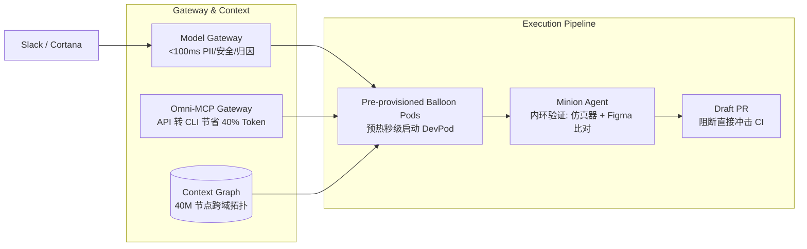

# AI Engineering & Harness 前沿情报雷达（2026 前沿成果）

基于 `ai-engineering-radar` 监测网络，本期雷达锁定两份**工业级重大突破资产**：
1. **Anthropic 官方工程实践**：《Harness Design for Long-Running Apps》与《Decoupling the Brain from the Hands (Managed Agents)》
2. **Uber 生产级软件工厂实战**：《Agentic SDLC at Uber》（AI Engineer World's Fair 2026）

---

## 研判一：Anthropic 新一代长程任务 Harness 与解耦架构

### 1. 核心定位与背景
- **信源**：Anthropic Engineering Blog（[Harness Design](https://www.anthropic.com/engineering/harness-design-long-running-apps) / [Managed Agents](https://www.anthropic.com/engineering/managed-agents)）
- **核心命题**：解决长程复杂全栈任务中的**“自我评价宽容（Self-evaluation Bias）”**、**“上下文焦虑早退（Context Anxiety）”** 与**“沙箱/会话/调度强耦合导致的运维灾难”**。
- **工程定位**：流程编排（Harness Orchestration）+ 运行时基础设施（Meta-Harness Architecture）。

### 2. 关键架构与核心设计

```mermaid
graph TD
    subgraph Meta-Harness: Decoupling Brain, Hands & Session
        Brain[Brain: LLM + Harness<br>无状态调度器]
        Session[(Session: Append-Only Event Log<br>会话日志持久化于 Context 之外)]
        Hands1[Hands: Ephemeral Sandbox<br>MicroVM / Container]
        Hands2[Hands: Proxy MCP / Tools<br>凭据隔离外部调用]

        Brain <-->|getEvents / emitEvent| Session
        Brain -->|execute/name, input| Hands1
        Brain -->|Proxy OAuth / Vault| Hands2
    end

    subgraph Multi-Agent GAN Loop
        Planner[1. Planner: 需求膨胀与高阶 Spec 制定] --> Gen[2. Generator: 按契约编码实现]
        Gen <-->|事前协商: Sprint Contract| Eval[3. Evaluator: 独立对抗审查与 Playwright 验收]
        Eval -- 发现缺陷回退 --> Gen
    end
```

#### ① 三主体分离的 Meta-Harness（Brain $\leftrightarrow$ Hands $\leftrightarrow$ Session）
- **告别“宠物容器”（No Pet Containers）**：
  - 过去将 Session、Harness 与 Sandbox 打包在同一个 Container 中，一旦容器崩溃整条会话丢失，且调试必须人肉进容器。
  - **解耦解法**：Sandbox 变成无状态的“牲畜（Cattle）”，通过 `execute(name, input) → string` 调度；Session 变为独立的 Append-only Event Log。若容器崩溃，Harness 捕获错误并重建容器；若 Harness 崩溃，通过 `wake(sessionId)` 从 Session Log 恢复。
- **会话持久化 $\neq$ Context Window**：
  - 彻底将长期状态与 LLM 瞬时上下文解耦。上下文作为外部对象持久化在 Session Log 中，Brain 按需执行切片检索（`getEvents()`），通过 Harness 转换后再喂给模型，避免暴力全量压缩或无损截断引发的信息丢失。
- **安全边界与凭证穿透阻断**：
  - **原则**：AI 生成的不可信代码运行的沙箱内，绝对不存放真实 Token。
  - Git Token 在容器初始化阶段注入 remote，Agent 内部只执行 `git push/pull`，无法读取原始 Token；第三方 API 通过 MCP Proxy 从外部 Vault 获取凭据，Agent 只能看到假值哨兵（Sentinel）。

#### ② GAN 启发式“对抗生成-评估”闭环（Generator-Evaluator Loop）
- **解决模型自评宽容陷阱**：单 Agent 对自己生成的代码/UI 天然倾向于“过度夸赞与敷衍通过”。
- **独立 Evaluator 角色**：
  - 调优一个独立的怀疑型（Skeptical）Evaluator，结合 **Playwright MCP** 实际运行应用、模拟用户点击、截屏并校验 DOM/DB/API 状态。
  - **事前契约协商（Sprint Contract）**：在编码前，Generator 与 Evaluator 必须先就“Done 的具体定义（可测试断言清单）”达成共识文件。
- **主观质量结构化度量**：针对前端/设计等非二元（Non-binary）任务，量化为四维矩阵：
  - **Design quality**（整体统一性与氛围）、**Originality**（原创度，严惩 AI 模板紫/白卡片）、**Craft**（排版与对比度技术基本功）、**Functionality**（交互可用性）。

#### ③ Harness 的演进哲学： assumptions go stale
- **核心法则**：*“Harness 的每个组件都编码了对当前模型能力的负向假设。当模型升级时，必须主动剔除过时的脚手架。”*
- **实证演进**：在 Claude Sonnet 4.5 时代为抵抗“上下文焦虑”必须引入强制的 Context Reset + 跨会话 Artifact 传递；而在升级到 Opus 4.6 后，模型长程保持能力提升，强制 Reset 与微观 Sprint 契约成为冗余包袱，收敛为端到端执行 + 终局对抗评估，单次会话可稳定推进数小时。

---

## 研判二：Uber 规模化软件工厂实战（Agentic SDLC at Uber）

### 1. 核心定位与背景
- **信源**：AI Engineer World's Fair 2026（[Agentic SDLC at Uber](https://aietalks.com/talks/agentic-sdlc-at-uber)）
- **核心命题**：跨数千名工程师、800+ 项目的超大型组织中，如何将 Agent 产出从“单兵玩具”推进到**占全司 70% PR 的工业级软件工厂**。
- **工程定位**：企业级研发基础设施 + 上下文图谱 + 自动化维护流水线。

### 2. 关键架构与核心设计



#### ① 上下文图谱（Context Graph）替代离散检索
- **痛点**：Agent 耗费 60% 以上 Token 在各系统间漫游（找微服务归属、找 Proto 依赖、查 Jira、查历史 Incident）。
- **解法**：建立统一的 **4000 万节点、150 种边关系** 的企业级知识图谱，把移动端、后端、数据湖、设计文档、代码拓扑与 On-call 事故报告连通，单次查询直接获取完整依赖上下文。

#### ② MCP Gateway 与 CLI 投影（Token 优化达 40%+）
- **反转模式**：将数千个内部 API 自动爬取转化为 MCP Server，再通过 Omni-MCP 投影为 **确定性 CLI 脚本（Code Mode）**。
- **收益**：避免将冗长的 JSON Schema 暴露在 LLM Prompt 中，Agent 通过编写 Python 脚本调用 CLI 执行操作，全司 Token 消耗降低 40% 以上。

#### ③ 预置气球容器池（Pre-provisioned Balloon DevPods）
- **性能瓶颈**：大型 Monorepo 冷拉取代码与构建索引极慢。
- **解法**：K8s 常驻预热 DevPod 池，内置代码快照与预建索引，Agent 申领后秒级就绪；提供包含全量关联仓的 Mega-Devpod 支撑跨仓变更。

#### ④ 软件工厂的内环验证与阻断策略（Inner Loop vs Outer CI）
- **CI 保护机制**：Agent（Minion）编码完成后**严禁直接触发全局 CI**，终点收口为 **Draft PR**。
- **内环轻量验证**：在 DevPod 内部运行单测、拉起微型仿真器、将前端渲染截屏与 Figma 原型进行像素级视觉比对，内环验证通过后才允许流转给人肉与外环 CI。

#### ⑤ 周期性维护闭环（Bounded Maintenance Loops）
- **非高峰期运作**：利用周日闲置 CI 算力运行自动重构（如废弃 AB 实验分支下线、迁移弃用 API、安全漏洞修补），控制周一推送给开发者的 Diff 数量，累计完成 250+ 次大型迁移（涉及 900 万行代码）。

---

## 行业前沿综合对照矩阵

| 维度 | Anthropic（2026 前沿） | Uber（2026 生产级落地） | 腾讯应用宝（2026 前沿） | Docker Sandbox Kit |
| :--- | :--- | :--- | :--- | :--- |
| **隔离与安全** | Brain 与 Sandbox 物理分离，Proxy 管理凭据 | Spire 身份认证 + <100ms 5模型安全网关 | 容器隔离 + 业务鉴权收敛 | MicroVM 隔离 + Authority as Code |
| **调度控制** | Generator-Evaluator 对抗 + 状态会话分离 | Minion Agent + Draft PR 截断 | Go 强类型编排 + State JSON + Hook | 声明式 OCI 镜像运行时 |
| **上下文供给** | 外置 Session Log + 按需切片读取 | 40M 节点 Context Graph + MCP 投影 CLI | 结构化知识金字塔 + Git Hash 增量更新 | 规范化 Mount 挂载与 Spec 声明 |
| **验证闭环** | Playwright MCP + 四维量化设计评估 | 内部仿真器 + Figma 视觉比对 | Codar 自动化 CR + 增量覆盖率门禁 | Conformance 契约测试集 |
| **防退化理念** | 主动拆除随模型升级而过时的 Harness | 维护任务限制吞吐，以评审数据驱动改进 | 串行收口核心入口，禁止全局 Memory | Diff 即审计，阻断权限静默外扩 |

---

## 关键工程启示（落地执行准则）

1. **坚决剥离 LLM 上下文与会话存储**：
   LLM 上下文窗口是昂贵且脆弱的“缓存”，不能充当唯一事实源；系统必须拥有外置的 Append-only 状态日志或 JSON SSOT。
2. **禁止让同一 Agent 兼任“作者”与“评委”**：
   在自动化流水线中，必须建立独立的 Evaluator 实例（配备 Playwright / 静态扫描 / 编译工具），并通过事前契约断言驱动 Generator 交付。
3. **警惕“工具 Schema 膨胀”吞噬 Token**：
   工具/MCP 数量激增时，不要把所有 Schema 塞进 Prompt；应效仿 Uber 模式，将工具封装为确定性 CLI 或代码脚本（Code Mode），由 Agent 自行编写短脚本调用。
4. **Harness 建设遵循“奥卡姆剃刀”**：
   基座模型能力提升时，原有的过度微观编排（如过细的 Sprint 分解、频繁的上下文 Reset）会变为纯负重，应定期做减法、动态重构 Harness。