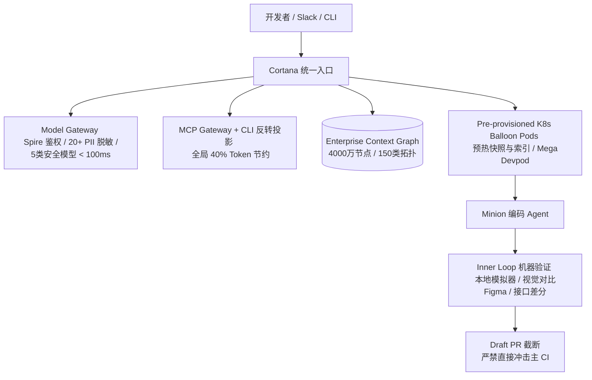

# 2026 AI 研发工程化（Harness & Agentic SDLC）前沿研判

根据雷达检索，2026 年行业在 **Agentic SDLC（智能体软件开发生命周期）** 与 **Harness Engineering（智能体容器与脚手架工程）** 领域已跨过“Demo 与 Prompt 技巧”阶段，全面进入“工业级软件工厂（Software Factory）”的基建收敛期。

本期雷达重点研判 2026 年最具工程深度的两个标杆案例与行业规范：
1. **Uber 实战**：《Agentic SDLC at Uber: Building Blocks for Uber’s Software Factory》（AI Engineer World's Fair 2026）
2. **行业规范**：ASDLC.io 工业级框架与 DigitalOcean Harness Runtime 架构规范

---

## 案例一：Uber 工业化软件工厂与 Agentic SDLC 实战

### 1. 核心定位与背景
* **标题与作者/机构**：*Agentic SDLC at Uber — Building Blocks for Uber’s Software Factory*（[AI Engineer World's Fair 2026](https://aietalks.com/talks/agentic-sdlc-at-uber)，Uday Kiran Medisetty, Distinguished Engineer & Adam Huda, Uber）
* **核心命题**：支撑全司 **>70% PR 由 Agent 自动生成**、900 万行代码自动化迁移的大规模企业级研发基建闭环。
* **工程定位**：**基础设施 / 流程编排 / 知识图谱 / 验证门禁**。

### 2. 关键架构与核心设计（硬核提炼）



1. **统一 Model Gateway 治理面**：
   * 800+ 内部项目、每日 1 亿+ 次模型调用均通过统一网关。
   * 基于 Spire 实现微服务 mTLS 身份绑定；实时过滤 20+ 类 PII；部署 5 个专用安全分类器，端到端延迟控制在 `<100ms`；实现精确到团队/项目的全链路计量与 Trace 审计。
2. **MCP Gateway 与 CLI 反转投影（Token 治理）**：
   * 自动爬虫把全司数千个内部 API 声明转换为 MCP Server。
   * **CLI 投影机制**：将 MCP 响应在沙箱内直接转化为 CLI 输出或由 Agent 生成 Python 脚本（Code Mode）在本地执行过滤，**避免大 JSON 暴力塞入上下文，全司 Token 消耗骤降 40%**。
3. **预置 DevPod（Balloon Pods）秒级供给**：
   * 采用 K8s 气球池（Balloon Pods）预先挂载 Monorepo 快照并预建代码索引，Agent 启动秒级就绪；提供跨跨仓库协同的 Mega Devpod。
4. **4000 万节点的企业 Context Graph**：
   * 融合 Monorepo、依赖拓扑、所有权（Ownership）、设计文档、Jira、告警与事故数据，通过图结构为 Agent 提供 Just-in-Time 上下文，取代单文件暴力 Grep。
5. **双循环验证门禁（Inner Loop vs Outer Loop）**：
   * **Inner Loop（内环闭环）**：Agent 在沙箱中直接跑模拟器、执行静态分析、截取 UI 截图与 Figma 进行视觉差分比对。
   * **Draft PR 截断**：Agent 产出必须在 Draft PR 处强制停住，严禁未达标代码直接触发昂贵的主 CI 管道。
6. **有界周期性治理（Bounded Maintenance Loop）**：
   * 将清理废弃代码、试验分支下线、事故防御规则等常态化治理放入周末闲置 CI 调度执行，并严格限制周一分配给工程师的 Diff 队列上限。

---

## 案例二：ASDLC.io 规范与 Harness Runtime 架构

### 1. 核心定位与背景
* **标题与机构**：ASDLC.io 标准规范（*The Agentic Software Development Life Cycle Framework*, 2026）与 DigitalOcean Harness Runtime 规范（*What Is an Agent Harness? Architecture and Setup in 2026*）。
* **核心命题**：定义从“手工业辅助（AI Assistant）”向“流水线软件工厂（Software Factory）”转型的标准化协议与运行时约束。
* **工程定位**：**流程编排 / 状态持久化 / 安全沙箱规范**。

### 2. 关键架构与核心设计

```
[Intent / Objective Packet]
        │
        ▼ (JIT Context via MCP)
[Specialized Station (Agent)]  <───  Harness Runtime (Durable State / Rollback)
        │
        ▼ (Deterministic Execution)
[Verification Gate (Sim/Diff)] ───►  PASS / BLOCKED / UNKNOWN
        │
        ▼ (Promotion Policy)
[Draft PR / Certificate]
```

1. **Cybernetic L3 协同模型（Fighter Jet 理论）**：
   * 确立“Agent 是操作飞机的飞行员，人类是座舱里的战术教官”。人类不逐行写代码，而是定义失败边界（Determinism）与战略意图（Context Objective Packet），防止模型向均值回归（Regression to the Mean）。
2. **Harness 三层解耦定义**：
   * **Framework（LangGraph/CrewAI）**：定义任务流逻辑。
   * **SDK（Claude/OpenAI SDK）**：调用基础模型能力。
   * **Harness Runtime**：负责进程沙箱隔离、长期 Durable State 落盘断点续传、Action Gateway 权限拦截与 Audit Trace。
3. **机器凭证（Certificate）与状态落盘**：
   * 必须将多步骤执行状态持久化在 Harness 层，而非存放在 LLM 对话上下文内。任务失败时能依据状态快照回退（Rollback）。

---

## 三、 行业横向对照与联系

| 维度 | Uber (2026 实战) | 阿里《AI Native手册》 / 腾讯实践 | Anthropic / Docker 规范 |
| :--- | :--- | :--- | :--- |
| **上下文供给** | **Context Graph (40M 节点)** + MCP API 自动生成 | 结构化知识金字塔 + AST 提取 | JIT 按需抓取 + Repo Rules |
| **Token 节约** | **MCP 转 CLI / Code Mode (省 40%)** | 强类型 Go 调度器替换 Prompt 编排 | 严格 Tool 作用域限制 |
| **验证与门禁** | **本地模拟器 + Figma 视觉差分 + Draft PR 截断** | Guardrail 三态门禁 (PASS/BLOCKED/UNKNOWN) | Machine Certificate + Promotion Policy |
| **执行环境** | **K8s Balloon Pods + Mega Devpod** | 隔离容器 + 串行收口机制 | Docker Sandbox Kit + MicroVM (Authority as Code) |
| **维护治理** | **有界周期维护（周末削峰跑重构）** | 缺陷归因改工作流 | 迁移消耗：验证 Token >> 编码 Token |

---

## 四、 落地实用价值与潜在陷阱

### 1. 可直接借鉴的工程设计
1. **MCP 的 CLI 投影模式**：避免将大尺寸 JSON 载入 Context，通过本地脚本过滤（Code Mode）或 CLI 流式输出，大幅降低注意力稀释与 Token 账单。
2. **Draft PR 隔离与内环门禁**：在沙箱内完成本地验证/差分比对，未完成凭证收集前严禁触发全量 CI，避免 Agent 产生大量无效构建冲击流水线。
3. **环境预热池（Ballooning）**：预置代码快照与 AST 索引的轻量运行时，解决 Agent 环境准备时间超过编码时间的倒挂问题。

### 2. 前置条件与成本陷阱
1. **Monorepo / Bazel / 契约依赖**：Uber 与阿里能落地的前提是成熟的单体大仓与确定性构建工具链；若存量系统依赖散乱、环境无法单键拉起，Agent 只会在环境报错中死循环。
2. **上下文过载陷阱**：无节制地向 Agent 灌入文档与全量接口会导致模型推理质量断崖式下跌，必须依靠 Context Graph 或分层索引做精确过滤。