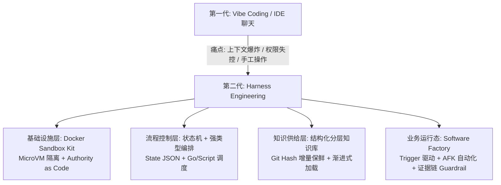
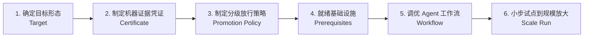

# 2026-09-25—27 专题讨论恢复

本文汇集历史会话中的 AI 回答，保留当时表述；不是本次重新核验的产品事实或推荐。原始提问链接及会话位置附在各节。


---

## 腾讯工程实践

用户提供的链接：https://www.bestblogs.dev/article/217da0f037

来源：会话第 22 行：`~/.omp/agent/sessions/-WebstormProjects-project-x-rebuild/2026-09-25T02-05-09-112Z_01a0d64f-3078-7408-ac35-006bfd60ae42.jsonl:22`。

这篇文章是腾讯应用宝团队（腾讯技术工程官方发布）在真实业务重构中的**一线实操复盘**。

如果说上一篇阿里的文档是**“高层架构白皮书与战略路线图”**，那腾讯这篇就是**“战壕里的一线工程落地手记”**。两篇恰好形成互补，且在关键结论上高度共识。

---

### 一、 一句话定调

**干货浓度极高，是一篇真正把大模型当作“不可靠组件”、用经典强类型工程体系给 AI 戴上“紧箍咒（Harness）”的硬核实战复盘。**

它最大的价值在于：**把很多团队在 Agent 落地中踩过的暗坑（上下文爆炸、AI 偷懒早退、多 Agent 冲突、Shell 脚本隐性 bug、RAG 检索不准）全挑明了，并给出了具体可执行的解法。**

---

### 二、 阿里白皮书 vs 腾讯实战：两篇的核心对比

| 维度 | 阿里《AI Native 研发范式实践手册》 | 腾讯《从 AI Coding 到 Harness Engineering》 |
| :--- | :--- | :--- |
| **视角定位** | 平台层 / 管理层（自顶向下） | 业务团队 / 一线架构师（自底向上） |
| **关注核心** | 基础设施、IAM 权限交集、企业级 Guardrail、组织变革 | 状态机驱动、知识库结构化、Worktree 并行、调度器防崩 |
| **共同认知** | **1. 编码已非瓶颈，环境与闭环才是；<br>2. AI 负责认知，脚本/程序负责执行；<br>3. 抛弃纯对话，必须依赖结构化状态与工程约束。** |

---

### 三、 深度解析：4 个最值得借鉴的硬核设计

#### 1. 状态文件驱动 + Hook 机制（干掉不可靠的对话记忆与“偷懒早退”）
- **痛点**：单会话窗口长对话必有损压缩、信息遗忘；AI 经常执行到一半就自作主张回复“已完成”，提前终止。
- **解法**：
  - **状态落盘**：拆分 `product-state.json` 与 `e2e-state.json` 作为唯一真相源（SSOT）。调度器和各个 Agent 只读写 JSON，完全不依赖会话上下文。
  - **Hook 强制门禁**：通过 `Stop Hook` 拦截 AI 的提前结束，只要状态机中未达到终态，强制打回继续执行；用 `SessionStart Hook` 实现断点续传，`SessionEnd Hook` 自动清理现场。

#### 2. 抛弃向量 RAG，采用“结构化知识金字塔 + 渐进式加载 + Git Hash 增量更新”
- **痛点**：传统向量 RAG 算相似度在精确工程场景下召回极不准；知识库几天就过时（“过期知识比没有知识更危险”）。
- **解法**：
  - **三层结构**：总览（Overview） $\rightarrow$ 业务域（Domain） $\rightarrow$ 服务级 8 类固定文档（接口、架构、依赖、配置、坑点等）。
  - **渐进式检索**：第一层关键词粗筛 $\rightarrow$ 第二层 `grep` 过滤 `meta.yaml` $\rightarrow$ 第三层按需读具体 MD，杜绝无脑全量塞 Prompt。
  - **新鲜度保鲜**：比较当前 `git hash` 与上次生成 hash，超阈值自动触发增量更新；**保留人工批注（Custom Docs）**，只更新事实性代码 diff。

#### 3. 调度架构的重大演进：从“LLM / Shell 驱动”后撤到“Go 强类型编排”
这是文章中最具实战价值的踩坑反思：
- **弃用纯主子 Agent 互调**：主 Agent 调度子 Agent 极易出现指令依从性失控（子 Agent 越界篡改主链路）。改由**外部强类型程序（Go）作为主调度器**，代码决定流程，仅在需要推理时唤起专门 Agent。
- **弃用 LLM 生成的 Shell 脚本**：大模型写的 Shell 脚本常藏有边界 bug 且无强类型校验，在长链路末端爆炸极难排查。改用强类型代码与固定脚本。
- **彻底禁用全局 Memory**：禁止全局记忆污染上下文，保持单一子任务的纯粹性与幂等性。

#### 4. DAG 拓扑编排与冲突治理（事前隔离 + 串行收口）
- **并行开发**：通过 `task-planner` 分析任务依赖生成 DAG，同层无依赖任务分配独立 `git worktree` 并行开发。
- **冲突治理原则**：**“能事前隔离的事前隔离，必须共享的串行收口”**。
  - 业务代码：通过 touch 预测文件级隔离；
  - 共享入口（如 `main.go`）与协议修改（Proto/DB/配置）：绝对不允许并行修改，前置串行生成桩代码，或后置在收口阶段由单一 Agent 处理。

---

### 四、 局限性与落地门槛（冷静看待）

1. **依赖重度的自建基建生态**：
   文中打通了腾讯内网的 tRPC 网关、Codar（AI 代码审查）、Rick（Proto 平台）、123 发布平台、七彩石配置等。如果是缺少这类内部标准化平台的中小团队，打通这些接口本身的研发成本巨大。
2. **知识库维护本身的冷启动成本**：
   维护 800+ 份覆盖 90 个微服务的结构化文档，即使有自动化 Skill 生成，在初期梳理和异常修正上依然需要投入相当的人力成本。
3. **目前依然是“前向执行”为主**：
   作者在文末坦言，目前系统处于“能跑”阶段，缺乏自主诊断、自我复盘和闭环自进化的能力，遇到未预期的异常仍需人工介入。

---

### 五、 总结与实用建议

如果说阿里的文章告诉你 **“要向 Harness 转型”**，腾讯这篇则详细告诉你 **“落地 Harness 时千万别用纯 Prompt 和 Shell，老老实实用强类型状态机管起来”**。

**如果你正在设计自己的自动化 Agent 流水线，这篇的落地指导原则是金科玉律：**
> **“AI 负责认知，程序负责执行；长链路必须状态化，知识库必须结构化，Agent 必须职责隔离，Workflow 比 Prompt 更重要。”**

---

## Docker Sandbox Kit 与 Software Factory

用户提供的链接：https://www.docker.com/blog/docker-sandbox-kit-spec/ ; https://www.aicodingdictionary.com/?term=software-factory

来源：会话第 38 行：`~/.omp/agent/sessions/-WebstormProjects-project-x-rebuild/2026-09-25T02-05-09-112Z_01a0d64f-3078-7408-ac35-006bfd60ae42.jsonl:38`。

这两份资料正好从**「安全运行时基础设施（Docker）」**和**「研发范式与概念定义（AI Coding Dictionary）」**两个维度，与前面阿里、腾讯的实践形成了完美的拼图闭环。

---

### 一、 资料 1：Docker Sandbox Kit Spec —— “Authority as Code（权限即代码）”

> **原文**：*“Containers package applications. Sandboxes contain agents.”*（容器打包应用程序，沙箱隔离智能体）

#### 1. 它解决了什么核心痛点？
传统的 Dockerfile 只描述**软件内部怎么构建和启动**，但描述不了**软件对外部世界索要的权限**（能访问哪些网络域名、挂载什么目录、注入什么 Token）。
在过去，开发者给 Agent 权限往往是即兴的（给一个宽泛的 GitHub Token、关掉防火墙、挂载根目录），这些权限分散在终端历史和个人大脑里，**不可重现、无法审计、不可协作**。

#### 2. 核心技术突破
- **基于 MicroVM 而非传统容器**：Agent 是概率性行为主体，拥有探测系统漏洞和提权的能力。传统容器共享宿主机内核，而 Docker Sandbox 用微虚拟机（MicroVM）在内核之下建立物理隔离边界。
- **将“权限声明”打入标准 OCI 镜像**：Kit 不发明新格式，而是使用标准 OCI 镜像的 Annotation（`vnd.docker.sandbox.kit.descriptor`）。
- **细粒度网络与代理鉴权（Proxy-Managed Credential）**：
  - 示例中声明了可以调 `api.github.com` 的读写，但显式 `DENY DELETE /repos/**`（否定规则优先）。
  - Token 不直接塞给 Agent，而是由沙箱宿主 Proxy 代理注入，Agent 内部只能看到哨兵假值（Sentinel）。
- **“Diff 即审查”**：当 Agent 镜像升级时，如果新版本多请求了一个域名或去掉了某条 Deny 规则，Git PR 的 Diff 上会清晰展示**权限变更**，机器门禁可直接拦截“权限外扩”。

---

### 二、 资料 2：Software Factory（软件工厂）与 AI Coding 概念词典

> **定义**：*“一种由触发器（Trigger：Issue 创建、定时任务、CI 失败、上游会话完成）而非人类手动启动 Agent 会话的工作系统，使更多工作在 AFK（脱机）状态下运行，将人类注意力保留在真正需要 HITL（人机协作决策）的地方。”*

Matt Pocock（AIHero.dev）在这本词典中建立了一套极其精准的行业术语体系：

| 概念术语 | 核心定义与工程内涵 |
| :--- | :--- |
| **Software Factory（软件工厂）** | 触发器驱动的无头流水线（如夜间 Cron 自动扫 Lint/单测提 PR，人类白天只审 PR）。 |
| **Dark Factory（黑灯工厂）** | 全流程由 AI 生产且**完全没有人肉审查**的代码库（类似于工业上的无人工厂，通常用于边缘/一次性系统）。 |
| **AX（Agent Experience，智能体体验）** | 类似 DX（开发者体验），衡量**代码库对 Agent 友好的程度**（是否有明确的类型系统、确定性 Check 脚本、清晰的 AGENTS.md 与架构屏障）。 |
| **AFK（Away From Keyboard）** | 开发者触发任务后直接合盖离开，Agent 在沙箱中跑完从编码、单测、CR 到部署的全流程。 |
| **Grilling（苏格拉底式盘问）** | 在进入方案设计前，Agent 逐步向人类提问澄清边界与意图的技术（防范需求发散）。 |
| **Attention Budget（注意力预算）** | 解释单窗口聊久了必变笨（进入 Dumb Zone）的根本原因：Token 增多导致注意力被二次方稀释。 |

---

### 三、 四份资料串联：AI 研发范式演进的全景图

将**阿里白皮书**、**腾讯落地实战**、**Docker 规范**与**软件工厂概念**放在一起，整个行业的演进脉络已经完全清晰：



1. **底层安全（Docker）**：用 MicroVM 和 OCI 规范解决 Agent 运行时的**隔离与权限边界（Authority as Code）**；
2. **中层编排（腾讯 & 阿里）**：用**状态文件落盘（State JSON）**替代脆弱的会话记忆，用**强类型代码/脚本**替代不可控的主子 Agent 调度，用**结构化知识库**提供精准上下文；
3. **顶层形态（Software Factory）**：从“人坐在电脑前看着 AI 一行行打字”，演变为“事件触发流水线，Agent 在隔离沙箱中批量交付，人类只在关键门禁审核 Diff 和裁决”。

---

### 四、 行业启示：我们需要准备什么？

1. **别再追求把所有东西塞进 Prompt**：上下文是有“注意力预算”的，长链路必须状态化、分层化。
2. **重视 AX（Agent 体验）建设**：未来代码库的竞争力，取决于是否有完备的类型推导、严格的静态检查、易解析的 CLI 和准确的架构文档。
3. **把权限和沙箱当成一等公民**：给 Agent 的权限必须可声明、可审计、最小化收敛，拒绝不可复现的个人本地环境授权。

---

## Hyper-Extract

用户提供的链接：https://github.com/yifanfeng97/Hyper-Extract/blob/main/README_ZH.md

来源：会话第 48 行：`~/.omp/agent/sessions/-WebstormProjects-project-x-rebuild/2026-09-25T02-05-09-112Z_01a0d64f-3078-7408-ac35-006bfd60ae42.jsonl:48`。

**Hyper-Extract**（`hyperextract`）是一个开源的**智能知识提取与结构化建模 CLI 工具 / Python 库**。

它的核心定位是：**通过大模型的 Function Calling 能力与 YAML 模板，将非结构化文档（PDF、Markdown、Word、财报、论文等）一键抽取并转化为结构化知识（知识图谱、超图、时空图、Obsidian 笔记等）。**

---

### 一、 核心功能与架构特性

1. **模板驱动的结构化抽取（Schema as Code）**
   - 内置了 80+ 覆盖金融、法律、医疗、科研等领域的预设 YAML 模板。
   - 用户只需定义实体字段（如 `name`, `type`, `description`）和关系 ID 规则，大模型会自动按强类型 Schema 输出，避免幻觉和格式漂移。

2. **支持 9 种复杂知识结构与多种检索算法**
   - 传统 RAG 仅切分纯文本块（Chunk），GraphRAG 仅支持简单实体-关系图。
   - Hyper-Extract 支持：**普通列表、图谱（Graph）、超图（Hypergraph）、时序图（Temporal Graph）、空间/时空图（Spatial Graph）** 等；集成 GraphRAG、LightRAG、Hyper-RAG、KG-Gen 等多种提取算法。

3. **知识可增量更新、溯源与回滚**
   - 每一条提取的事实都会打上 `--source` 文档标签。
   - 当原文档更新时，重喂文档会自动 **Upsert / 回滚旧事实**；当文档废弃时，可通过 `he remove --document` 彻底撤销该文档贡献的所有图谱节点，解决知识库过期污染问题。

4. **开箱即用的导出与可视化**
   - **Obsidian 联动**：一键导出为带 `[[双向链接]]` 的 Markdown 笔记库（可以直接用 Obsidian 打开查看网络关系）。
   - **原生 MCP 支持**：内置 `he-mcp` 服务器，提取出的知识库可以直接作为 MCP Tool 挂载给 Claude Desktop、Cursor 等 Agent 调用。
   - **可视化与查询**：内置交互式拓扑图预览（`he show`）与语义问答（`he search`）。

---

### 二、 与我们前面讨论的工程实践对照

| 前文概念 | Hyper-Extract 的对应实现 |
| :--- | :--- |
| **腾讯实践中的“知识库工程”** | 腾讯使用专用 Skill 提取 8 类服务文档；Hyper-Extract 用 **80+ 领域 YAML 模板** 将通用文档结构化。 |
| **“过期知识比没有知识更危险”** | Hyper-Extract 通过 **Source 溯源追踪 + 增量 Upsert / Document 级回滚** 实现知识保鲜。 |
| **Agent 工具链集成** | 提供标准 **MCP Server（`he-mcp`）**，让外部 Agent（如 Claude/Cursor）以只读工具形式检索提取好的知识。 |

---

### 三、 适用场景与优缺点

- **最适合**：
  - 需要把大量离散的技术方案、业务 PRD、学术论文或行业合规文档，快速沉淀为 **Obsidian 双链笔记** 或 **知识图谱**；
  - 给本地 Agent 搭建一个支持语义查询 + 拓扑关系检索的垂直知识库。
- **局限**：
  - 核心抽取依赖大模型并发调用的 Function Calling，文档量极大时（成千上万页）会产生可观的 Token 消耗（推荐搭配 DeepSeek 或本地 vLLM 降低成本）。

---

## O’Reilly：Scaling AI Adoption in Engineering

用户提供的链接：https://github.com/lukeTheNeuromancer/-_Skill/blob/main/oreilly-scaling-ai-ebook.pdf

来源：会话第 70 行：`~/.omp/agent/sessions/-WebstormProjects-project-x-rebuild/2026-09-25T02-05-09-112Z_01a0d64f-3078-7408-ac35-006bfd60ae42.jsonl:70`。

已将这本 O'Reilly 2026 年新书 **《Scaling AI Adoption in Engineering: A Practical Framework for Leaders》**（作者 Peter Bell，O'Reilly CTO 顾问、Gather.dev / Dev Tool Collective CTO）下载并通读完成。

当前版本为 Early Release（第 3 版修订，涵盖前言及第 1~4 章全部正文与后续全书大纲）。

---

### 一、 这本书是写给谁的？核心命题是什么？

- **定位**：这不是一本教你怎么写 Prompt、怎么搞 Vibe Coding 或底层模型训练的技术书，而是**专为 CTO、工程副总裁（VP of Eng）和技术管理者量身定制的“组织转型与 SDLC 变革指南”**（特别是针对 100+ 工程师的中大型研发团队）。
- **核心痛点**：引用了 2025 年 NANDA 和 METR 的权威调研——**大量企业给工程师采购了 Copilot 账号，但实际业务 ROI 为零甚至为负**；与此同时，少数企业却实现了交付效能的成倍跃升。
- **全书一句话论点**：**“AI is an amplifier.”（AI 是工程底座的放大器）**。AI 无法拯救混乱的工程流程，它只会成倍放大你现有的优势或缺陷；AI 落地本质是一个**组织变革管理（Change Management）问题**，而非工具选型问题。

---

### 二、 核心章节深度拆解

#### 1. 第一章：两类公司的戏剧性对照（A Tale of Two Orgs）
作者虚构了两个极具代表性的企业画像：
- **Flatline Systems（反面教材：机械式采购）**：
  - 800 人团队，测试覆盖率低、手工 QA、部署靠人肉。
  - CTO 采购了 20 个 Copilot 账号，作为第 6 个季度 KPI 强塞给一位新总监。
  - 限制极多：不给专项预算、不批新工具（Cursor/Claude/测试工具）、不改排期、甚至要求“想用 AI 必须先立军令状保证提效 10%”。
  - **结局**：没有任何产出提升，试点核心骨干流失，管理层得出“AI 没用，只适合初创团队”的悲观结论。
- **Summit SaaS（正面标杆：体系化工程）**：
  - 180 人团队，DevEx 成熟，测试覆盖率 90%，全自动化 CI/CD 与特性开关（Feature Flag）。
  - CTO 与董事会明确战略，抽调平台总监 **全职带队 18 个月** 负责 AI 落地。
  - **治理与审批**：与法务/CISO 划定极简红线（如禁止第三方模型拿数据训练），建立 **3 个工作日审批 SLA**，月费 1 万美元以下实验无需前置证明 ROI。
  - **多工具与赋能**：配备全职 DevRel 教练，提供多款 Agent 工具，容忍初期 10-15% 的短期效率波动以换取组织技能演进。
  - **沉淀资产**：搭建全局 Context Repository（上下文库），将 PRD 作为代码提交到 GitHub 与 Agent 联动，30%~40% 的功能实现 Agentic 端到端闭环。

#### 2. 第二章：AI 是放大器（AI as an Amplifier）
- **四大先决条件**：
  1. **文化与信任（Culture & Trust）**：必须将实验与 KPI / 绩效考核解耦，营造心理安全感，避免员工产生“藏私/防御”心理。
  2. **客户中心的协作（Customer-Centered Collaboration）**：薄切片（Thin-sliced）需求，PR 越小、上下文越清晰，AI 幻觉越低。
  3. **卓越工程底座（Engineering Excellence）**：**TDD 在 AI 时代是核心设计方法**（先与 AI 约定好期望的行为与断言，让 AI 自主写代码跑单测闭环）；完备的自动化 CI/CD 和 Feature Flag 是承载 AI 批量产出的唯一容器。
  4. **开发者体验（DevEx）与平台团队**：平台团队是 AI 赋能的天然载体。
- **深刻警示**：AI 转型给组织带来的冲击，堪比**“公司被并购重组”**。工程师必须明白，未来不需要只负责照图抄码的“Code Monkey”，工程师的核心价值转向**问题严密定义、架构边界约束与自动化验证**。

#### 3. 第三章：业务战略与赛道选择（What’s Your Strategy?）
- **受冲击程度评估（Impact Assessment）**：
  - 实体经济（如连锁滑雪场、健身房）：受 AI 颠覆的威胁极低，可稳健推进；
  - 通用 SaaS / 软件工具（如 Jira、Salesforce、低代码）：面临被 AI-First 重构或被 API 化降维的**生存危机**，必须激进投入。
- **挑选赛道（Picking a Lane）**：
  - **Innovator（创新者）**：全员激进探索，接受试错成本与换血阵痛；
  - **Early Adopter（早期采用者）**：紧跟成熟实践，按周迭代；
  - **Early Majority（早期大众）**：等待行业出现明确赢家后再按季度标准化推广；
  - **Late Majority / Laggard（落后者）**：只用老牌厂商内嵌的 AI 功能。
  - **关键原则**：选哪条赛道都可以，**但全公司必须言行一致**——最忌讳 CEO 在外高喊 AI Leading，内部法务和安全却用落后者的审批流程卡死一切实验。

#### 4. 第四章：落地执行计划与矩阵（What's Your Plan?）
针对不同赛道，作者给出了具体运营维度的执行标准：

| 运营维度 | 创新者（Innovator） | 早期采用者（Early Adopter） | 早期大众（Early Majority） |
| :--- | :--- | :--- | :--- |
| **工具审批** | 3~5 天极速审批，极简红线，万元内免 ROI 证明 | 1 周内评审，重点评估供应商护城河与退出预案 | 成立评审委员会，要求明确的行业案例与 ROI |
| **招聘考核** | **强制在面试中配合 AI 编程**，考察问题拆解能力 | 鼓励使用 AI，看重综合工程素质与学习意愿 | 不做特殊要求，保持传统标准 |
| **管理基调** | **AI 是强制基线，工程师尽快停止手工编写和逐行看代码** | 强烈鼓励，树立标杆案例 | 稳健宣导，作为工程现代化的一环 |
| **组织配置** | 50 人以上配备 **全职 AI 赋能专员/教练**，周度 Demo | 平台团队兼顾赋能，双周 Demo / 内部 Playbook | 依托标准培训课程与既有流程推广 |

---

### 三、 全书未完章节蓝图（Part 2 & Part 3 剧透）

从目录规划来看，后续章节将深入具体落地细节：
- **Part 2: The Agentic SDLC**：
  - 第 7 章：How to Build a Software Factory（如何构建软件工厂）；
  - 第 8 章：Capturing and Delivering Context（上下文捕获与供给）；
  - 第 10 章：Verification（验证闭环）；
  - 第 11 章：Deploying and Operating Software（部署与运维）。
- **Part 3: The Agentic Engineering Org**：
  - 组织架构重组、招聘、AI 治理、Token 成本控制、转型期领导力。

---

### 四、 总结与横向串联

将这本书与我们前面讨论的所有内容放在一起：
1. **理论与管理层（本书 O'Reilly & 阿里白皮书）**：明确指出 Coding 提效是伪命题，**“AI 是放大器，瓶颈在环境、验证、上下文与组织变革”**；
2. **工程实现层（腾讯端到端实践 & Docker Sandbox Kit）**：给出了具体的工程解法——**状态文件驱动、强类型编排、结构化知识库、MicroVM 隔离与 Authority as Code**；
3. **概念与终局（Software Factory）**：最终研发模式必然从“个人在 IDE 里聊天”，演变为“事件触发的、具有确定性门禁的软件工厂”。

---

## Anthropic：代码现代化准备

用户提供的链接：https://claude.com/blog/how-to-prepare-for-ai-driven-code-modernization-projects

来源：会话第 77 行：`~/.omp/agent/sessions/-WebstormProjects-project-x-rebuild/2026-09-25T02-05-09-112Z_01a0d64f-3078-7408-ac35-006bfd60ae42.jsonl:77`。

这是 Anthropic 官方在 2026 年 9 月发布的 **《现场手记（Notes from the Field）》系列文章**，由其驻场前线工程师（Forward Deployed Engineers）基于企业级客户大型遗留系统改造实战撰写。

---

### 一、 核心论点与背景

**“AI 让代码现代化改造的耗时从几年缩短到几周，但瓶颈迅速转移到了组织治理与证据链验证。”**

在银行等强监管与关键业务场景中，过去的代码评审流程是建立在“人写、人审”的假设上。当 Agent 以 10 倍速度批量产出代码时，人肉逐行 Review 必定崩溃。Anthropic 提出的核心解法不是“如何让 AI 写得更好”，而是**“如何建立自动化证据凭证（Certificate）与分级放行策略（Promotion Policy）”**。

---

### 二、 核心六步法体系（The 6-Step Framework）



#### 1. 确定目标形态（Target：明确范围与改造模式）
- **升级（Uplift）**：同技术栈升版本（如 C++11 $\rightarrow$ C++20），行为不变。
- **转换（Transform）**：跨技术栈重写但行为严格等价（如 COBOL $\rightarrow$ Java），生产系统最偏好此类（风险可控）。
- **重塑（Reimagine）**：新架构 + 业务逻辑变更（最难，因为缺乏客观基准，需额外编写严格的行为规范 Spec）。
- **工具支持**：使用静态分析提取隐性业务规则与依赖图谱（结合 Anthropic 的 `code-modernization` 插件）。

#### 2. 制定机器证据凭证（Certificate：自动化正确性标准）
**核心原则：凭证必须能无人工介入（No HITL）全自动判定。**
- 原有测试套件 + AI 生成的增量测试套件；
- **对抗性审查（Adversarial Review）**：在全新上下文窗口中由另一个独立模型进行审查；
- **差分测试与流量回放（Traffic Replay）**：针对 Transform 场景，对比新旧系统对相同真实输入的输出一致性；
- **与业务负责人共同签署凭证**：在项目启动前就让负责上线的资深专家确认——“只要通过这些测试，我就敢合入”。

#### 3. 制定分级放行策略（Promotion Policy：打破人肉全量 Review）
- **按爆炸半径与置信度分级**：边缘无状态模块依靠 Certificate 自动过门禁；核心资金/主干路径保留专家介入。
- **前置专家精力**：专家（SME）不再坐在末端看几万行 Diff，而是在前期参与凭证设计、抽样调优。
- **“修改工作流，而不是修改单个 Diff”**：当某类缺陷反复出现时，去优化 Agent 的 Workflow 和 Prompt 约束，严禁让人去手工修补每次生成的代码。

#### 4. 必备前置条件（Prerequisites）
- **环境隔离**：专用远程 Host 运行 Agent，**只有改造分支的写权限，绝对不给生产凭据**（同前述 Docker Sandbox Kit 理念一致）；
- **冻结与切片策略**：在不断代（In-place）改造中，从依赖树的最底层叶子节点向内逐层切片冻结改造，并通过 CI 门禁禁止未改造代码反向污染。

#### 5. 调优 Agentic 工作流（Dynamic Workflow）
- 将 Target、Certificate、Promotion Policy、业务规则注入为项目知识库。
- 在小范围代码上打磨，确保大部分生成的改动能一次性满足 Certificate。

#### 6. 运行与分摊成本优化
- **Token 消耗分布**：真实项目中，**验证（Verification）消耗的 Token 远多于写代码**。
- **成本优化策略**：
  - 将计算重的验证信号放在廉价门禁（类型检查、轻量单测）通过之后；
  - 机械性大批量工作用性价比模型（如 Sonnet），核心转换与对抗审查才调用顶级推理模型。

---

### 三、 横向串联：业界顶尖实践的高度收敛

把目前几份核心材料放在一起，可以看到业界头部（Anthropic、Docker、阿里、腾讯、O'Reilly）已经形成了**完全统一的方法论共识**：

| 维度 | Anthropic（本文） | 腾讯（应用宝实战） | 阿里（白皮书） | Docker（Sandbox Kit） |
| :--- | :--- | :--- | :--- | :--- |
| **验收标准** | **Certificate（证据凭证）** | 接口验证 + 增量覆盖率 + Codar CR | **Guardrail 三态证据聚合** | Conformance Suite |
| **放行机制** | **Promotion Policy（分级放行）** | 状态机驱动，串行收口确认 | IAM 5层交集 + Challenge | Authority as Code（Diff 即审查） |
| **执行逻辑** | **改 Workflow 不改单个 Diff** | AI 负责认知，Go/脚本负责执行 | 平台不判断业务，只执行规则 | OCI 规范 + MicroVM 隔离 |
| **工作模式** | **前置 SME 精力，末端自动化** | DAG 并行 + Worktree 隔离 | 组织转向 Execution Graph | 自动化 Kit 编排 |

---

### 四、 核心启示

1. **不要寄希望于人工 Review AI 产出的海量代码**：必须把精力花在**“构建可自动检验的凭证（Certificate）”**上。
2. **现代化重构最怕需求摇摆**：先定死是 **Uplift、Transform 还是 Reimagine**，否则团队会在“是等价迁移还是顺便加需求”的争论中无限内耗。
3. **沉淀工作流资产**：重构完成后，产物不仅是新代码，更重要的是**这套自动化的改造工作流、规则库与验证凭证**，它们能持续复用于下一次升级。

---

## GenOffice

用户提供的链接：https://github.com/genspark-ai/genoffice

来源：会话第 87 行：`~/.omp/agent/sessions/-WebstormProjects-project-x-rebuild/2026-09-25T02-05-09-112Z_01a0d64f-3078-7408-ac35-006bfd60ae42.jsonl:87`。

**作用非常大，尤其切中了目前大模型与 Agent 生态中一个长期存在的“硬伤”痛点。**

它的核心价值不仅在于“做了一个开源的 AI Office 办公套件”，更在于**为 AI Agent（如 Claude Code、Cursor）提供了操控真实 Office 文档的标准基础设施**。

---

### 一、 它解决了什么核心痛点？

过去大模型在办公文档处理上一直很尴尬：
1. **Agent 只能输出半成品**：Agent 最擅长写 Markdown 或简单 HTML，一旦让它产出正式的 `.docx`、`.xlsx`、`.pptx`，通常只能靠 Python 的 `python-docx` 或 `openpyxl` 拼凑代码，极易破坏复杂排版、丢样式、或者把公式写死为静态文本。
2. **商业套件昂贵且封闭**：微软 M365 Copilot / WPS AI 绑定云端生态，收费高（M365 约 $30/人/月），且无法自由换用 DeepSeek、本地私有大模型（vLLM）或自定义 Agent 工具链。

---

### 二、 最有价值的 4 个杀手级特性

#### 1. Agent 原生交互：CLI + MCP 支持（最大亮点）
它不仅是一个有 GUI 界面（macOS/Win/Linux）的软件，更内置了 **Headless CLI 工具（`genoffice`）** 和 **标准 MCP Server**：
- **Claude Code / Cursor 可以在后台直接调用它**：读取、生成、修改真实的 Word/Excel/PPT，而无需打开窗口。
- **自带验证闭环（Verification Loop）**：比如让 Agent 做一份 PPT，Agent 可以调用 `genoffice slides check` 检查文字溢出，调用 `slides render` 将生成的 PPT 逐页渲染成 PNG 图片喂给视觉大模型审查，发现版面不好看再精准替换指定页面，直到满足要求。这与我们前面讨论的 **“Harness 自动化验证闭环”** 完美契合。

#### 2. 字节级格式保全（Byte-Preserving）与可信编辑
- **不破坏未修改内容**：打开复杂排版的 Word 文档让 AI 修改其中一段，只有被修改的段落被重写，其余复杂的图表、页眉页脚、宏原封不动。
- **真实 Excel 公式**：AI 生成的表格包含动态的 `SUMIF`、透视表和引用关系，而不是死数据。
- **审阅模式（Track Changes）与一键回滚**：AI 改动会以 Word 标准的“修订模式”呈现，支持一键撤销。

#### 3. 隐私安全 + BYOK（自带 API Key）+ 本地模型
- **端到端离线处理**：文档解析、格式转换、PDF 编辑、本地 SQLite 索引均在本地完成，文件不上传云端。
- **模型自由**：可接入 DeepSeek、Claude、OpenAI、Qwen，也可直连本地 vLLM/Ollama，符合企业数据合规需求。

#### 4. 本地 PDF 原生编辑与格式互转
- 底层基于 PDFium 实现页面内文本直接原地修改（非涂层批注）。
- 本地免云端直接将 PDF 转换为可编辑的 `.docx`、`.xlsx`，附带系统 OCR。

---

### 三、 典型落地场景与实用价值评估

| 用户场景 | 实用价值评级 | 具体用途 |
| :--- | :---: | :--- |
| **Agent / 自动化流水线（Software Factory）** | ⭐⭐⭐⭐⭐ **（极高）** | 充当 Agent 的 Office 驱动层。自动化任务跑完后，直接交付客户可编辑的标准 `.pptx` 汇报、`.xlsx` 财务报表、`.docx` 交付件。 |
| **开发者 / 极客** | ⭐⭐⭐⭐⭐ **（极高）** | 用自己便宜的 API Key（如 DeepSeek）或本地模型，低成本获得媲美 M365 Copilot 的日常文档辅助。 |
| **普通日常重度办公用户** | ⭐⭐⭐ **（中等）** | 日常轻度编辑很舒服，但若涉及超大型复杂宏/VBA、特殊排版格式时，目前仍无法完全替代经过几十年打磨的 MS Office 桌面版。 |

---

### 四、 总结

如果只是当成一个**普通办公软件**，它是一个优秀的开源轻量替代品；
但如果把它看作**“让 AI Agent 具备操作现实 Office 世界能力的基础设施（Harness 工具）”**，它的价值极大，填补了开源生态在这一领域的空白。

---

## Paperclip

用户提供的链接：https://github.com/paperclipai/paperclip

来源：会话第 129 行：`~/.omp/agent/sessions/-WebstormProjects-project-x-rebuild/2026-09-25T02-05-09-112Z_01a0d64f-3078-7408-ac35-006bfd60ae42.jsonl:129`。

**Paperclip** 是一个开源的 **AI 智能体团队编排与组织治理操作系统（Agentic OS & Org Control Plane）**。

用它官方最生动的一句话概括：
> **“如果单体 Agent（如 Claude Code、Codex、OpenClaw）是‘员工’，那么 Paperclip 就是‘公司’。”**

---

### 一、 它解决什么痛点？（从“管终端”到“管公司”）

很多团队和个人在深度使用 Agent 时，很快会遇到以下混乱：
1. **多终端失控**：电脑上开了 20 多个 Claude Code / Cursor / 终端窗口，根本记不清哪个在干什么，电脑一重启全丢。
2. **上下文孤岛**：每次开新窗口都要重新喂业务目标、架构上下文，Agent 之间无法自主协同。
3. **Token 账单失控**：死循环或低效调用可能瞬间烧光几百美元，缺乏按部门/按项目的硬预算门禁。
4. **缺乏流程与治理**：Agent 无法做到 7x24 小时自主推进任务，且没有正规的工单（Ticket）、审批（Approval）和审计追踪。

---

### 二、 Paperclip 的四大核心支柱（The 4 Pillars）

Paperclip 表面上看起来像一个 **工单/任务看板（类似 Jira/Linear）**，但底层是一套完整的智能体组织基础设施：

```
┌──────────────────────────────────────────────────────────────┐
│                       PAPERCLIP SERVER                       │
│                                                              │
│  ┌───────────┐  ┌───────────┐  ┌───────────┐  ┌───────────┐  │
│  │Identity & │  │  Work &   │  │ Heartbeat │  │Governance │  │
│  │  Access   │  │   Tasks   │  │ Execution │  │& Approvals│  │
│  └───────────┘  └───────────┘  └───────────┘  └───────────┘  │
│                                                              │
│  ┌───────────┐  ┌───────────┐  ┌───────────┐  ┌───────────┐  │
│  │ Org Chart │  │Workspaces │  │  Plugins  │  │  Budget   │  │
│  │ & Agents  │  │ & Runtime │  │           │  │ & Costs   │  │
│  └───────────┘  └───────────┘  └───────────┘  └───────────┘  │
└──────────────────────────────────────────────────────────────┘
         ▲              ▲              ▲              ▲
   ┌─────┴─────┐  ┌─────┴─────┐  ┌─────┴─────┐  ┌─────┴─────┐
   │Claude Code│  │   Codex   │  │ CLI/Cursor│  │  HTTP/Bots│
   └───────────┘  └───────────┘  └───────────┘  └───────────┘
```

1. **智能体组织架构（Org Chart for Agents）**
   - 给每个 Agent 分配职位（CEO、CTO、前端工程师、测试员、市场）、汇报线（Reporting Lines）与职责边界。
   - 支持跨模型/跨运行时混编（Claude Code、Codex、Cursor、本地脚本、HTTP Webhook 等只要支持 Heartbeat 都能“入职”）。

2. **目标驱动的任务流（Agentic Task Manager）**
   - 任务带有完整的**目标树继承链（Goal Ancestry）**，Agent 执行时不仅知道“做什么”，还知道“为什么做”。
   - 支持任务锁定、原子检出（防止多 Agent 撞车）、依赖阻塞（Blocker）和状态持久化。

3. **心跳唤醒与定时调度（Heartbeats & Routines）**
   - Agent 依托心跳机制按 Cron/事件/队列自动唤醒工作，无需人工时刻坐在电脑前监工（真正的 AFK 模式）。

4. **治理、审批门禁与成本硬预算（Governance & Budget Control）**
   - **预算熔断**：可按公司、项目、具体 Agent 设置每月 Token/金额预算，超限自动挂起，绝不跑飞。
   - **董事会审批（Board Approval）**：涉及关键架构、发版或危险操作时，强制暂停并等待人类管理员确认。

---

### 三、 它与前面讨论的“软件工厂（Software Factory）”如何呼应？

前文提到 Matt Pocock 词典中的 **Software Factory（由触发器驱动，人类只需做 HITL 审查）**，Paperclip 正是这一理念的**开源商业化实体落地**：

| 理念 / 需求 | Paperclip 的对应实现 |
| :--- | :--- |
| **触发器驱动 / 脱机运行（AFK）** | **Routines & Heartbeats 队列**，按定时或事件自动唤醒 Agent 领工单干活。 |
| **多 Agent 冲突治理** | **Workspaces（Git Worktrees）** 隔离与原子任务锁。 |
| **人类把关门禁（HITL & Guardrail）** | **Governance & Approval 机制**，只在关键交付节点让人类看 Diff、看测试报告、点通过。 |
| **组织度量与成本控制** | 全局 Token 消耗监控、按 Agent 审计与硬预算熔断。 |

---

### 四、 总结与定位

- **它不是**：聊天机器人（Chatbot）、模型提示词管理器、也不是低代码拖拽工作流。
- **它是**：**面向“多智能体公司”的控制平面（Control Plane）**。如果你只用单个 Agent 写点小脚本，用不上它；但如果你在尝试让 10~20 个 Agent 协同跑完产品、研发、测试、运营全生命周期，Paperclip 是目前开源界最成熟的组织调度系统。